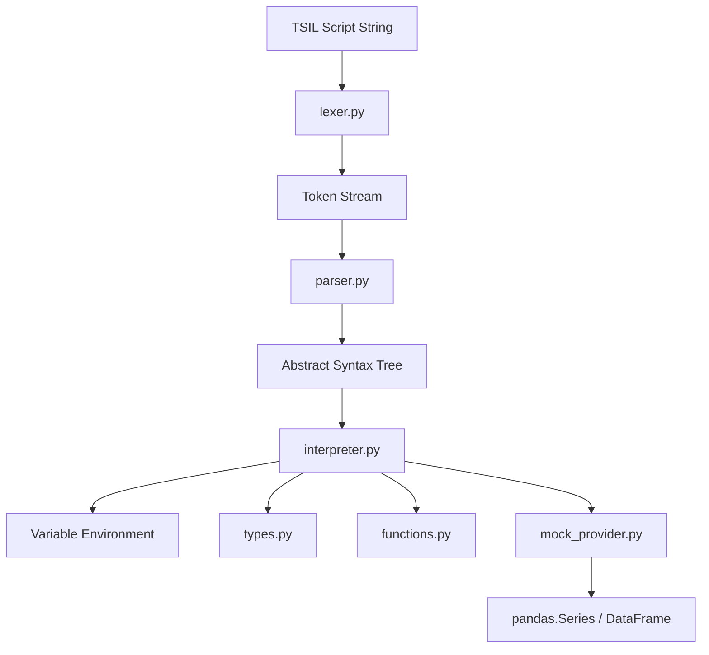

# TSIL Interpreter Implementation Plan

We will build a complete, self-contained interpreter for **Timeseries Intermediate Language (TSIL)** in Python. The interpreter will parse TSIL scripts, execute them, and interface with a mock timeseries data provider to produce realistic pandas-based timeseries.

## Proposed Architecture

We will structure the interpreter into the following components inside the `tsil` package:



### Components

1. **Lexer (`lexer.py`)**: Tokenizes the input string.
   - Specifically handles Date/Datetime literals (`YYYY-MM-DD` and `YYYY-MM-DDTHH:mm:ss`), strings, numbers, identifiers, standard operators, and ignores comments (`#`).
   - **Multi-line Expressions**: To handle multi-line expressions (like long math formulas or multi-line function calls), the lexer tracks open/closed parenthetical contexts `()`, `[]`, and `{}`. Newlines inside open parentheticals are treated as whitespace and ignored, while newlines at the end of complete statements act as logical statement separators. This enables identical behavior to standard Python multi-line expressions.
   - **Semicolons**: The lexer and parser will support semicolons `;` as optional statement separators or terminators (e.g. `x = 1; y = 2;`), allowing multiple statements on a single line or explicitly terminated statements.
2. **Parser (`parser.py`)**:
   - Parses the token stream into an Abstract Syntax Tree (AST) using a recursive descent parsing strategy.
   - Supports variables, binary and unary operators, list structures, and function calls with positional and keyword arguments (e.g. `t(["SPX", "SX5E"], weights=[0.3, 0.7])`).
   - **AST Serialization**: Each AST node will implement `to_dict()` and a class method `from_dict(d)` to easily serialize/deserialize the AST to/from JSON or Python dictionaries. This fulfills the TSIL requirement to save, store, and reload compiled ASTs.
3. **Interpreter (`interpreter.py`)**:
   - Evaluates the AST nodes sequentially.
   - Manages the environment state (variables mapping).
   - Supports evaluating a serialized AST directly by deserializing it first.
4. **Types (`types.py`)**:
   - Implements TSIL objects:
     - `Ticker`: Baskets and single tickers with weighting schemes (`WGT_EQ`, `WGT_VOL`, `WGT_MOM`, `WGT_MCAP`).
     - `Expiry`: Handles fixed dates, tenors, and forward tenors.
     - `Strike`: Handles absolute, moneyness, delta-based, and normalized strikes.
     - `Timeseries`: Wraps `pandas.Series` to hold metadata (`id`, `name`, `value_type`) and overrides operators (`+`, `-`, `*`, `/`, `**`, and comparisons like `>`) to align indices.
     - `BacktestResult`: Represents results of `bt(...)`, supports multiplying by a signal, and exposes `PL`, `PLVega`, `PLCarry`, `PLOther`.
5. **Functions (`functions.py`)**:
   - Implements built-in math and timeseries functions: `sqrt`, `diff`, `pct_change`, `corr`, `cov`, `std`, `mean`, `ma` (moving average), `sharpe`, `sum`, `min`, `max`, `mode`, `percentile`, `drawdown`.
   - Implements backtest functions: `CALL`, `PUT`, `SD`, `RR`, `PS`, `CS`, `CCS`, `PCS`, `notional`, `bt`.
6. **Mock Provider (`mock_provider.py`)**:
   - Generates deterministic, pseudo-random business day timeseries for metrics (`IV`, `SPOT`, `FWD`, `RZ`, `GC`, `VC`, `VGC`) based on the input parameters (ticker, expiry, strike).

---

## Proposed Changes

We will create a clean package structure under `c:\code\git\tsil2`:

### [Component Name] TSIL Interpreter Package

#### [NEW] [lexer.py](file:///c:/code/git/tsil2/tsil/lexer.py)
Implements regex-based tokenization. It will support:
- Date: `\d{4}-\d{2}-\d{2}`
- Datetime: `\d{4}-\d{2}-\d{2}T\d{2}:\d{2}:\d{2}`
- String: `"[^"]*"`
- Number: `\d+(\.\d+)?`
- Boolean/None: `True`, `False`, `None`
- Operators: `+`, `-`, `*`, `/`, `**`, `==`, `!=`, `<`, `>`, `<=`, `>=`, `and`, `or`, `not`
- Symbols: `(`, `)`, `[`, `]`, `,`, `=`

#### [NEW] [parser.py](file:///c:/code/git/tsil2/tsil/parser.py)
Implements recursive descent parsing of tokens into AST nodes. AST nodes will include:
- `AssignNode(name, value_expr)`
- `BinaryOpNode(left, op, right)`
- `UnaryOpNode(op, expr)`
- `CallNode(func_name, args, kwargs)`
- `ListNode(elements)`
- `LiteralNode(value)`
- `NameNode(name)`

#### [NEW] [types.py](file:///c:/code/git/tsil2/tsil/types.py)
Defines representation classes:
- `Ticker(symbols, weights)`
- `Expiry(expiry, duration=None)`
- `Strike(level, strike_type=None)`
- `Timeseries(series, name, value_type)`: Inherits from/wraps `pandas.Series` to preserve alignment and metadata.
- `BacktestResult(df)`: Exposes columns as `Timeseries` properties and supports `* sig` to return scaled P&L.

#### [NEW] [functions.py](file:///c:/code/git/tsil2/tsil/functions.py)
Provides runtime implementations for all TSIL functions, including mathematical/statistical operations on `Timeseries`, option instruments, and a mock `bt` backtester.

#### [NEW] [mock_provider.py](file:///c:/code/git/tsil2/tsil/mock_provider.py)
Implements deterministic generator for `IV`, `SPOT`, `FWD`, `RZ`, `GC`, `VC`, `VGC` timeseries. For testing, these timeseries will have daily frequency on business days from a reference date (e.g. 2025-01-01 to 2026-06-18) so operations align out-of-the-box.

#### [NEW] [interpreter.py](file:///c:/code/git/tsil2/tsil/interpreter.py)
Evaluates parsed AST. Exposes an `evaluate(script_str, env=None)` entrypoint.

#### [NEW] [user_manual.md](file:///c:/code/git/tsil2/docs/user_manual.md)
A comprehensive, formal user manual documenting TSIL syntax, types, metrics, math/timeseries operations, backtester details, and workflow examples.

#### [NEW] [agent_reference.md](file:///c:/code/git/tsil2/docs/agent_reference.md)
A concise, structured reference card designed specifically to be injected into an LLM's system prompt (or context) to guide the agent in generating valid TSIL scripts without hallucinating types or function names.

#### [NEW] [test_interpreter.py](file:///c:/code/git/tsil2/tests/test_interpreter.py)
A test suite covering:
- Lexing and parsing validation
- Basic arithmetic & function calling
- Metric queries and mock timeseries generation
- Operations and mathematical functions (e.g., rolling std, drawdown, sharpe)
- Backtest definitions, signals, and sizing

---

## Verification Plan

### Automated Tests
We will run `pytest` to execute tests in the `tests/` directory:
```powershell
pytest tests/
```

### Manual Verification
We will run a demo script executing the workflow examples from the TSIL specification (e.g., Analyzing Single Index Volatility Term Structure, Multi-Asset Basket Analysis, Backtesting Buy Gamma) to print the results and assert correctness.
